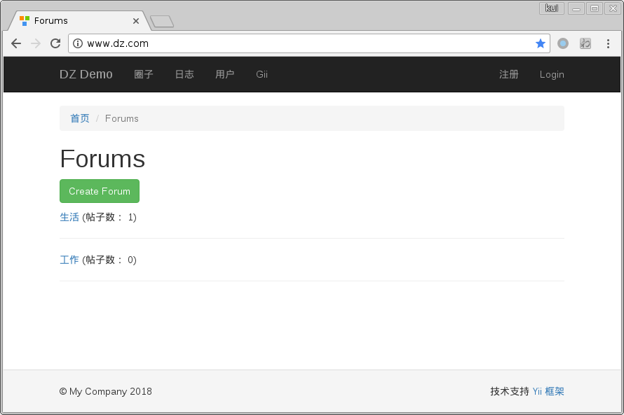

这是一个基于 Yii2 Basic Template 搭建的论坛 Demo, 主要目的是演示 Yii2 事件机制的使用。

## 一 安装

### 1.1 下载代码压缩包至本地

在项目目录下执行 `composer install` 安装所需依赖包；

### 1.2 安装数据库文件
   
新建名为 `dz` 的数据库，将根目录下 `demo.sql` 导入到该数据库内；

### 1.3 配置

- 在 `config/` 目录下，复制 `sensitive.json.sample` 为 `sensitive.json`, 并修改 `sensitive.json` 内的密码为自己的数据库密码(注意文件安全性)；
- 配置 Apache, 使其能够正常访问，搭建成功的首页截图如下：

## 二 使用

> 提示：先点击右上角“注册”，注册一个帐号。

本 Demo 中一下操作中使用了事件机制：

- 用户登录后向日志表中记录登录时间；
- 用户发帖后：
    - 对应圈子帖子数+1 (`forum.post_count`);
    - 积分 +5
- 用户点赞帖子后：
    - 自己的积分 -1, 同时向日志表中记录积分变动明细;
    - 帖子作者的积分 +1, 同时向日志表中记录积分变动明细;
